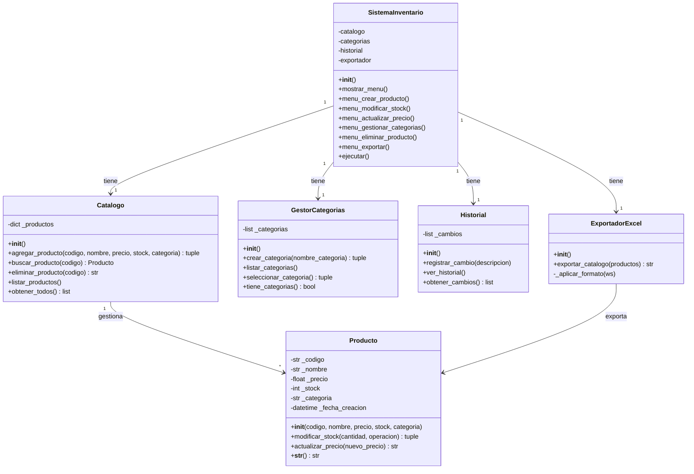

# PROYECTO POO- GRUPO: Solitare code


"Con inventory ni una tuerca se pierde

inventory es una herramienta moderna y gratuita para gestionar inventario y productos en almacenes de cualquier tamaño
¡organiza tu mundo como si fuera el fin del mundo!"


"Tecnología del mañana, ¡hoy mismo en su almacén! Con inventory, el futuro de la logística... está asegurado."
## Descripcion General
Este proyecto simula un sistema de gestión de inventarios,no se enfoca en una area en especifico ya que esta diseñado para que cada persona pueda tomarlo y modificiarlo segun sus necesidades, fue desarrollado en Python utilizando Programación Orientada a Objetos (POO).

El sistema permite:
- Registrar productos.
- Asignarles registro y categoria.
- modificar precios y stock.
- Mantener un registro de todos los movimientos realizados.
- Observar el atologo completo.
## Enfoque de la solucion
Primero se abordo el problema desde un punto de vista utilitarista.

1. Se penso en cuales deberian ser los primeros procesos que debia poder realizar el inventario.
2. Se pensaron las clases y el como podrian estar relacionadas entre si.
3. Se generaron funciones especificas para hacer cosas tales como : generar registros, generar productos etc.
4. Una vez comprobado que las funciones hicieran su trabajo de forma indivudual se fueron organizando mediante las clases propuestas anteriormente, aunque durante el proceso hubieron algunos cambios y cosas eliminadas.
5. Se pulio el acabado y se organizo en paquetes para facilidad de futuras ediciones, cambios y mejoras.

## Diagrama de clases
Este diagrama muestra el diagrama actual del proyecto.


y el empaquetado se ve de la siguiente forma: 
```
inventario/
├── modelos/
│   ├── __init__.py
│   ├── producto.py
│   ├── catalogo.py
│   ├── categorias.py
│   └── historial.py
├── exportador.py
└── sistema.py        
```
##  Implementación del codigo:

##  Requisitos previos
Para este codigo sera necesario tener instalado python y la libreria openpyxl.
- Versión mínima requerida: Python 3.7.
- Versión recomendada: Python 3.9.

Además, para el correcto funcionamiento del codigo se debera instalar openpyxl, para hacerlo se puede ir a nuestra consola y escribir :
```cmd
pip install openpyxl
```

##  Funcionamiento 
1. Debera descargar la carpeta llamada inventario, una vez hecho esto podra abrirla desde su visualizador de codigo de confianza.
2. El programa se ejecuta desde 
```cmd
Inventario/sistema.py
```
o bien puede hacer lo anterior o abrir el codigo en el editor y ejecutarlo desde ahi.

3. Se ejecutará una ventana en la consola en la cual se le solicitara que elija alguna de las opciones. 


4. Como puede ver las diversas opciones le permitiran gestionar el inventario. Aqui una explicacion de que hace cada una:
   -*Crear nuevo producto*: con esto podra crear un producto y añadirle los atributos correspondientes. 
   
   -*Ver catalogo*: Aqui podras ver el catalogo de tus productos, sus caracteristicas y demas.

   -*Modificar stock*: Con esta opcion podras editar la cantidad de productos que tienes.

   -*Actualizar precio*: Con esta opcion podras modificar el precio de tus productos.

   -*Historial de cambios*: Aqui podras ver todos los cambios que se la han generado a cada uno de los productos. 

   -*Exportar catalogo a excel*: Te permite generar un excel con los productos que tienes generados, este te dirá  su codigo, , que precio tienen, la categoria y el stock que tienen.

   -*Gestionar categorias*: Aqui podras ver que categorias hay creadas o crear categorias nuevas

   -*eliminar producto*: Aqui podras eliminar los productos que ya no desees.

   -*salir*: Con esta opcion podras salir del programa.

## Observaciones

Este codigo no está finalizado por ende tiene diversos inconvenientes:

- Aun no tiene la posibilidad de tener una persistencia de datos.
- Al generar el archivo de excel hay q ir a la carpeta donde esta el proyecto y ejecutar el excel desde ahi
- Falta de interfaz grafica
- El sistema no es util para aplicaciones demasido grandes, esto debido a que esta pensado para ser usado por sistemas pequeños y mas familiares/

  

   


---
